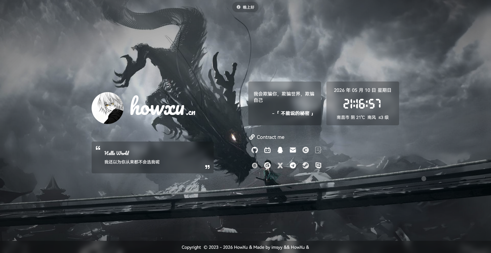

# Home - Personal Homepage

> [中文](./README_CN.md) | English



A Vue 3-based personal homepage with weather, music player, hitokoto quotes, time capsule, and more.

**Live Demo**: [howxu.cn](https://howxu.cn)

---

## Table of Contents

- [Features](#features)
- [Tech Stack](#tech-stack)
- [Requirements](#requirements)
- [Installation](#installation)
- [Environment Variables](#environment-variables)
- [Project Structure](#project-structure)
- [API Reference](#api-reference)
- [Components](#components)
- [Utilities](#utilities)
- [Customization](#customization)
- [Build \& Deploy](#build--deploy)

---

## Features

- **Weather Display** - Real-time weather using Amap (高德地图) API with fallback
- **Music Player** - APlayer integration supporting NetEase Cloud Music playlists
- **Hitokoto (一言)** - Random quotes from custom API
- **Time Capsule** - Progress tracking for day/week/month/year
- **Wallpaper Gallery** - Multiple wallpaper sources (default, daily bing, random scenery, ACG)
- **Social Links** - Customizable social media links with hover tips
- **PWA Support** - Offline-capable Progressive Web App
- **Responsive Design** - Mobile-first adaptive layout
- **Custom Cursor** - Animated following cursor effect
- **Mourning Mode** - Auto grayscale on commemorative dates

---

## Tech Stack

| Category | Technology | Version |
|----------|------------|---------|
| Framework | Vue | 3.5.x |
| Build Tool | Vite | 5.4.x |
| State Management | Pinia | 2.2.x |
| UI Library | Element Plus | 2.8.x |
| Icons | Icon Park | 1.4.x |
| Date Utils | dayjs | 1.11.x |
| Music Player | APlayer | 1.10.x |

---

## Requirements

- **Node.js**: >= 22.0.0
- **Package Manager**: npm, pnpm, or yarn

---

## Installation

```bash
# Install dependencies
npm install

# Development server (http://localhost:3000)
npm run dev

# Production build
npm run build

# Preview production build
npm run preview

# Lint & format
npm run lint
npm run format
```

---

## Environment Variables

Create a `.env` file in the project root:

```env
# Site Info
VITE_SITE_NAME=Your Site Name
VITE_SITE_URL=https://yourdomain.com
VITE_SITE_AUTHOR=Your Name
VITE_SITE_MAIN_LOGO=/images/logo.png
VITE_SITE_START=2020-01-01
VITE_SITE_ICP=ICP备案号

# Description (supports HTML)
VITE_DESC_HELLO=<strong>Hello</strong>
VITE_DESC_TEXT=Welcome to my homepage
VITE_DESC_HELLO_OTHER=<strong>Welcome Back</strong>
VITE_DESC_TEXT_OTHER=Explore more features

# Music Player (NetEase Cloud Music)
VITE_SONG_SERVER=netease
VITE_SONG_TYPE=playlist
VITE_SONG_ID=7452421335
VITE_SONG_API=https://api.example.com/music

# Weather API (Amap - 高德地图)
VITE_WEATHER_KEY=your_amap_key
```

### Variable Details

| Variable | Type | Required | Description |
|----------|------|----------|-------------|
| `VITE_SITE_NAME` | string | Yes | Site display name |
| `VITE_SITE_URL` | string | No | Site URL (default: `imsyy.top`) |
| `VITE_SITE_AUTHOR` | string | Yes | Author name |
| `VITE_SITE_MAIN_LOGO` | string | Yes | Path to site logo |
| `VITE_SITE_START` | string | No | Site launch date (YYYY-MM-DD) |
| `VITE_SITE_ICP` | string | No | ICP备案号 for footer |
| `VITE_DESC_HELLO` | string | Yes | Greeting text (supports HTML) |
| `VITE_DESC_TEXT` | string | Yes | Description text |
| `VITE_DESC_HELLO_OTHER` | string | No | Greeting when box is open |
| `VITE_DESC_TEXT_OTHER` | string | No | Description when box is open |
| `VITE_SONG_SERVER` | string | No | Music server (`netease` or `tencent`) |
| `VITE_SONG_TYPE` | string | No | Type (`song`, `playlist`, `album`, etc.) |
| `VITE_SONG_ID` | string | No | Playlist/Album ID |
| `VITE_SONG_API` | string | No | Custom music API endpoint |
| `VITE_WEATHER_KEY` | string | No | Amap API key (uses fallback if not set) |

---

## Project Structure

```
src/
├── api/
│   └── index.js           # API functions
├── assets/
│   ├── socialLinks.json   # Social links data (primary)
│   ├── socialLinks2.json  # Social links data (secondary)
│   └── siteLinks.json     # Site navigation links
├── components/
│   ├── Background.vue     # Wallpaper background
│   ├── Footer.vue         # Footer with copyright/lyrics
│   ├── Hitokoto.vue       # Random quote display
│   ├── Links.vue          # Site links section
│   ├── Loading.vue        # Page loading animation
│   ├── Message.vue        # Main info card (logo + description)
│   ├── MoreContent.vue    # Additional content placeholder
│   ├── Music.vue          # Music control panel
│   ├── Player.vue         # APlayer wrapper
│   ├── Set.vue            # Settings panel
│   ├── SocialLinks.vue    # Social links component
│   ├── TimeCapsule.vue    # Time progress tracker
│   └── Weather.vue        # Weather display
├── store/
│   └── index.js          # Pinia store
├── style/
│   ├── global.scss       # Global SCSS variables
│   └── style.scss        # Global styles
├── utils/
│   ├── cursor.js         # Custom cursor animation
│   ├── debounce.js       # Debounce utility
│   ├── getTime.js        # Time utilities
│   └── url.js            # URL utilities
└── views/
    ├── Box/
    │   └── index.vue     # Box popup (TimeCapsule + MoreContent)
    ├── Func/
    │   └── index.vue     # Function area (time + weather)
    ├── Main/
    │   ├── Left.vue      # Left panel (Message)
    │   └── Right.vue      # Right panel (Func + Links)
    └── MoreSet/
        └── index.vue      # Settings popup
```

---

## API Reference

All API functions are in `src/api/index.js`:

### getPlayerList(server, type, id)

Fetches music playlist from custom API.

**Parameters:**
| Name | Type | Default | Description |
|------|------|---------|-------------|
| `server` | string | `netease` | Music server (`netease` or `tencent`) |
| `type` | string | `playlist` | Query type (`song`, `playlist`, `album`, etc.) |
| `id` | string | `7452421335` | Playlist/Album ID |

**Returns:**
```javascript
[
  {
    name: string,      // Song title
    artist: string,    // Artist name
    url: string,       // Audio URL
    cover: string,    // Cover image URL
    lrc: string       // Lyrics URL
  }
]
```

### getHitokoto()

Fetches random quote from hitokoto API.

**Returns:**
```javascript
{
  hitokoto: string,  // Quote text
  from: string       // Source
}
```

### getAdcode(key)

Gets user location by IP using Amap API.

**Parameters:**
| Name | Type | Description |
|------|------|-------------|
| `key` | string | Amap API key |

**Returns:**
```javascript
{
  city: string,     // City name
  adcode: string   // City code
}
```

### getWeather(key, city)

Gets weather info using Amap API.

**Parameters:**
| Name | Type | Description |
|------|------|-------------|
| `key` | string | Amap API key |
| `city` | string | City adcode |

**Returns:**
```javascript
{
  lives: [{
    weather: string,      // Weather condition
    temperature: string,  // Temperature
    winddirection: string,// Wind direction
    windpower: string     // Wind power level
  }]
}
```

### getOtherWeather()

Fallback weather API when Amap key is not configured.

**Returns:**
```javascript
{
  result: {
    city: { City: string },
    condition: {
      day_weather: string,
      min_degree: string,
      max_degree: string,
      day_wind_direction: string,
      day_wind_power: string
    }
  }
}
```

---

## Components

### SocialLinks

Displays social media links with hover tooltips.

**Props:**
| Prop | Type | Default | Description |
|------|------|---------|-------------|
| `source` | string | `socialLinks` | Data source (`socialLinks` or `socialLinks2`) |

**Data Format** (`src/assets/socialLinks.json`):
```javascript
[
  {
    name: string,   // Link name
    icon: string,   // Icon path
    tip: string,    // Hover tooltip
    url: string     // Link URL
  }
]
```

### Weather

Displays current weather with auto-detection of user location.

**Features:**
- Auto-detects city via Amap IP API
- Falls back to alternative weather API if no key configured
- Supports wind direction formatting

### Music

Control panel for music playback.

**Features:**
- Play/Pause control
- Previous/Next track
- Volume slider
- Music list popup
- Keyboard shortcut: `Space` to toggle play

### TimeCapsule

Shows time progress for various periods.

**Displayed Data:**
- Today progress (hours elapsed)
- This week progress (days elapsed)
- This month progress (days elapsed)
- This year progress (days elapsed)
- Site uptime (if `VITE_SITE_START` configured)

### Player

APlayer wrapper component.

**Props:**
| Prop | Type | Default | Description |
|------|------|---------|-------------|
| `theme` | string | `#efefef` | Player theme color |
| `volume` | number | `0.7` | Default volume (0-1) |
| `songServer` | string | `netease` | Music server |
| `songType` | string | `playlist` | Content type |
| `songId` | string | `7452421335` | Playlist ID |
| `listFolded` | boolean | `false` | List default folded |
| `listMaxHeight` | number | `420` | List max height in px |

---

## Utilities

### getTime.js

```javascript
// Get current time object
getCurrentTime()
// Returns: { year, month, day, hour, minute, second, weekday }

// Get time capsule data
getTimeCapsule()
// Returns: { day, week, month, year } with progress info

// Show greeting message
helloInit()

// Check commemorative dates (grayscale mode)
checkDays()

// Calculate site uptime
siteDateStatistics(startDate)
```

### debounce.js

```javascript
// Create debounced function
const debouncedFn = debounce(func, wait, immediate)
```

### url.js

```javascript
// Parse site URL for logo display
getSiteUrl()
// Returns: ['subdomain', 'domain'] e.g. ['howxu', 'icu']
```

### cursor.js

```javascript
// Initialize custom cursor
cursorInit()
```

---

## Customization

### Adding Social Links

Edit `src/assets/socialLinks.json` and/or `src/assets/socialLinks2.json`:

```json
[
  {
    "name": "GitHub",
    "icon": "/images/icon/github.png",
    "tip": "Visit my GitHub",
    "url": "https://github.com/yourname"
  }
]
```

### Adding Site Links

Edit `src/assets/siteLinks.json`:

```json
[
  {
    "name": "音乐",
    "icon": "CompactDisc",
    "link": "https://music.example.com"
  }
]
```

Icons can be chosen from [@vicons/fa](https://www.xicons.org/).

### Commemorative Dates (Mourning Mode)

Edit `src/utils/getTime.js` `anniversaries` object:

```javascript
const anniversaries = {
  "4.4": "清明节",
  "5.12": "汶川大地震纪念日",
  // Add more dates here
};
```

### Wallpaper Sources

Wallpaper types in `src/components/Background.vue`:

| Type | Source | URL |
|------|--------|-----|
| 0 | Default (local) | `/images/background{N}.jpg` |
| 1 | Daily Bing | `https://api.dujin.org/bing/1920.php` |
| 2 | Random Scenery | `https://api.vvhan.com/api/wallpaper/views` |
| 3 | Random ACG | `https://api.vvhan.com/api/wallpaper/acg` |

---

## Build & Deploy

### Build

```bash
npm run build
```

Output is in `dist/` directory.

### PWA

The project uses Vite PWA plugin. Service worker auto-updates when new version is deployed. Configurable in `vite.config.js`.

### Deployment

The site can be deployed to any static hosting:

- Cloudflare Pages
- Vercel
- Netlify
- GitHub Pages

---

## License

Forked from [imsyy/home](https://github.com/imsyy/home).

This project is for personal use. Please follow the original project's license.

---

## Acknowledgments

- [imsyy/home](https://github.com/imsyy/home) - Original project
- [Element Plus](https://element-plus.org/) - UI components
- [Icon Park](https://iconpark.oceanengine.com/) - Icons
- [APlayer](https://github.com/MoePlayer/APlayer) - Music player
